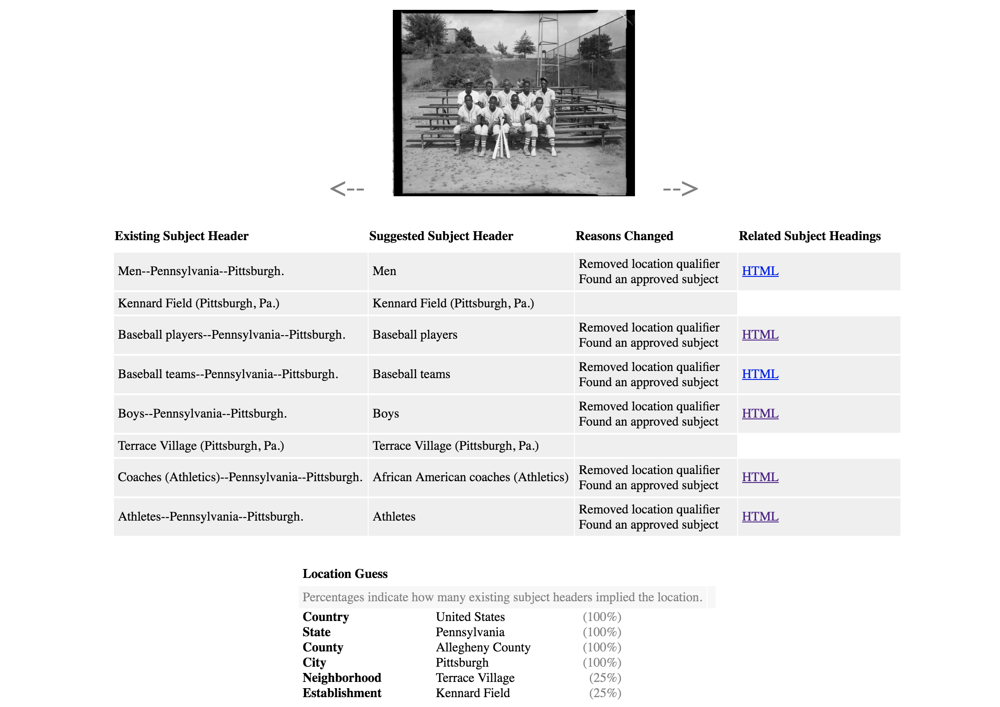
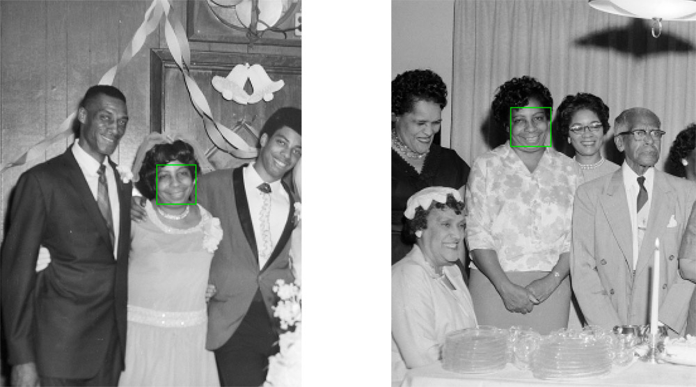

## Teenie Week of Play

This repo contains the code for one week of intensive, dedication to scripting and testing experimental code to document the limitations and capabilities of machine learning, text parsing, and crowdsourcing technologies on making a meaningful contribution to the archival metadata of the [Teenie Harris collection](https://cmoa.org/art/teenie-harris-archive/).

This work is building off of the significant [work](https://www.cmu.edu/news/stories/archives/2017/september/neh-grant.html) of the Zarhia Howard, Golan Levin, and David Newbury at the STUDIO for Creative Inquiry (STFCI). 

Our Week of Play participants included:

* Dominique Luster, Neil Kulas, and Travis from CMOA 
* Golan Levin from CMU's Frank-Ratchye STUDIO for Creative Inquiry
* Jesse Hixon and Patrick Burke from Carney
* Sam Ticknor and Caroline Record from the CMP Innovation Studio

During the week we explored four areas: Auto shortening titles, cleaning up existing subject headings, extracting names and and locations from descriptions using NER, and verifying face recognition data using Amazon Mechanical Turk. 

###Subject Headings

**Rational:** Having properly assigned Library of Congress (LOC) approved subject headings is part of having a processed archive. Currently the Teenie collection has subject headings, but they don't follow best practice. 

**Approach:** We created a tool in JavaScript that looks through the current subject headings, refines them, and extracts location data. It confirms that the subject headings are LOC approved and if not suggests an approved one. It removes unnecessary location qualifiers. It uses the google maps api to see how many times various locations are referenced in the subject headings and produces a list of locations with a percentage of confidence.  

**Results:**

Correctly removing location qualifiers and suggest an approved subject heading. 

Removing location qualifiers and generating a possibly racist suggestions on coaches. 

Correctly removing location qualifiers and suggest an approved subject heading for Selma Burke.

**Future Work:** Combine this work with the NER location extraction 

###Natural Entity Recognition

**Rational:** Currently the majority of the Teenie Harris photographs have long descriptive titles that contain locations and names. Extracting the location and name data from the longer description would lay the ground work for geotagging the images and identifying all the people in them.

**Approach:** We used the Named Entity Recognition (NER) in python to extract locations and names out of the titles. We first tried the NER built into [NLTK](https://www.nltk.org/) and then tried the [Stanford NER](https://nlp.stanford.edu/software/CRF-NER.shtml).

**Results:** Stanford's NER (S-NER) worked significantly better than the one built into NLTK. Based off a sample size of 100 the S-NER extracted all the names successfully 73% of the time. When it did fail it was most often because of a location being confused for a name (Other reasons documented [here](NER/README.md))

Here are a a few cases of where it succeeded:

* Pittsburgh Pirates baseball team manager Fred Haney posing with Birmingham Black Barons player Dwight Smallwood, at Forbes Field
	* Names extracted: Fred Haney, Dwight Smallwood

* Group portrait of Grace Memorial Presbyterian Church basketball players, front row from left: David Cook, William Hicks, Alfred Hunt, Joe Baber and Crocker; back row: coach Joe Baber, Nolan, Ronald Moon, C. Paige, and  Walter Boon, posed in Herron Hill gym
	* Names extracted: David Cook, William Hicks, Alfred Hunt, Joe Baber, Crocker, Joe Baber, Ronald Moon, C. Paige, Walter Boon

* Mal Goode, and woman posing beside Dodge car, at 1959 Pittsburgh Courier Home Service Fair, Syria Mosque
	* Names extracted: Mal Goode

Here are a few where it failed to extract the names correctly:

* Children, some in bathing suits, possibly including Rebecca Tab in center, Vernon Vaughn in light colored top, and Sara Mae Allen in back, standing on Webster Avenue under spray from fire hose, near Webster Avenue firehouse at Wandless Street, Hill District
	* Names extracted: Rebecca Tab, Vernon Vaughn, Sara Mae Allen, Hill District

* Boxer "Jersey" Joe Walcott with baby on lap getting haircut from barber Clarence "Speedy" Williams in Crystal Barber Shop
	* Names extracted: Boxer, Joe Walcott, Clarence, Williams

* Eddie Cooper and Wilhelmina handing out samples to women carrying basket style purses, behind Pepsi and Teem booth, at 1963 Pittsburgh Courier - WAMO, Home-A-Rama fair, Syria Mosque
	* Names extracted: Eddie Cooper, Wilhelmina, Home-A-Rama

**Future Work:** This is a promising approach for applying a simple technique to  clean archival metadata. It would improve the script significantly to give it a list of Pittsburgh locations to check against and to teach it to recognize nick-names. Doing the process of separating names from the larger description is essential to bridging the gap between the STFCI's work visually identifying the figures in the image and linking those figures with an actual name. 

###Mechanical Turk

**Rational:** The STFCI applied face recognition across the entire collection and generated 3452 potential matches. Each match comes with a score of how strong the match is. This process generated a range of results.Some matches are simply duplicates of images across the collections. 
Some matches are slightly different images from the same shoot.

Some matches "the holy grails" appear to identify the same people in totally different locations a contexts.

Some matches are incorrect, matching people of different genders and ages. 

Since the project generated such a range of results it is necessary to have all but the strongest matches verified by humans. During the Week on Play we experimented with using [Amazon Mechanical Turk](https://www.mturk.com/) to verify potential matches. 

**Approach:** We created two surveys, each with 5 potential matches. The surveys asked participants to id whether the matches depicted were correct or not with four levels of certainty. We put in one obviously correct and one obviously incorrect match in the batch to verify the participant was reliable. We had 15 people do each do the surveys. We paid 50 cents for one of the surveys and 25 cents for the other. 

**Results:** We got results back within an 1.5 hours for both surveys. On average the results successfully ID's blatantly correct and incorrect matches.

**Future Work:** In this experiment we manually coded the surveys. In future we could use the Mturk API to automatically generate these surveys and feed the results directly back into json. We could automatically get more confirmation on matches in which there is more disagreement. To scale this across all 3456 matches would cost a minimum of $520. We generated that cost based off the following assumptions. 

* Reasonable mechanical turk rate at 4 cents per each match. (20 cents for 
answering 5 questions) 
* Confirming the top 450 matches twice = $36.00 
* Confirming the remaining 3,002 four times = $480.32 



###Auto Shortening Titles

**Rational:** The titles are currently paragraph descriptions and too long to use on many labels/credits. Currently Dominique has to manually shorten each title on an as needed basis. To reduce this work load and lay the ground work for applying it across the collection, we investigated automatically suggesting shortened titles. 

**Approach:** We used the python modules spacy and textacy to break each description down into a part of speech. 

**Results:**
Before: Eight members of Ebenezer Little Rens basketball team posed in gymnasium

After: Eight members of Ebenezer Little Rens basketball team in gymnasium

Before: Group portrait of fifteen South Hills High School basketball players, kneeling, left to right: John Bolla, Ray Sineway, John Carr, Henry Hemphill, Paul Rue and John Patterson; standing: Harry Guldatti, Tony Jeffries, Ken wade, Cal Jones, Paul Dorsett, Coach Bruce J. Weston, Carl Wade, Ulna Calloway, Jack Kress, and Andy Dick

After: fifteen South Hills High School basketball players

Before:Children, including Cub Scouts and Brownies, posing on grandstand with television personalities Lolo and Marty Wolfson, with sign for TV Safety Rangers, at WTAE studio

After: Children at WTAE studio

Before: Mal Goode, and woman posing beside Dodge car, at 1959 Pittsburgh Courier Home Service Fair, Syria Mosque

After: Mal Goode and woman at 1959 Pittsburgh Courier Home Service Fair , Syria Mosque

Before: Nat King Cole, Harold Keith, George Pitts, and Gulf Oil executive Roy Kohler, posed in Carlton House for Capitol Records press party

After: Nat King Cole in Carlton House

Before:Group portrait of clergy and church leaders, from left, seated: Rev. E. W. Gantt, Rev. E. F. Smith, Rev. Eugene E. Morgan, Bishop Stephen G. Spottswood, Rev. A. E. Harris, Rev. A.L. Pierce, and Rev. C. C. Nobles; standing: Rev. W. C. Ardrey, Dave Williamson, Rev. C. C. Ware, Willa Mae Rice, Mrs. B. F. Wright, P. L. Prattis, Rev. F. D. Porter, Rev. W. T. Kennedy, Rev. B. F. Wright, Rev. A. Nicholson, Rev. W. F. Moses, Rev. M. L. Banner, Rev. Allie Mae Johnson, Rev. L. Comer, Rev. A. L. Fuller, and Rev. Charles Foggie, posed in Wesley Center AME Zion Church for meeting on AMICO Corp.

After: clergy and church leaders

Before: Men and women, including Prince "Big Blue" Bruce and Mrs. Bruce gathered around their son, John N. Bruce in U. S. Army uniform and holding little boy, in Bruce home, Rose Street

After: Men and women in U. S. Army uniform in Bruce home , Rose Street

Before: Board of Education of Central Baptist Church members, seated, from left: Josephine Moore, Edith Venable, guest of honor; Rev. W. Augustus Jones, Mrs. Isaac Green, and Bell Lunn; standing:  A.D. Taylor, Andrew Brookins, Catherine Graham, Robert Bailey, Evelyn Young, Isaac Willoughby, Christine Jones, Jack Fisher, Oplenell Rockamore, Clarence Payne, and Helen Thompson, gathered in Central Baptist Church for baby shower, another version

After: Board of Education in Central Baptist Church

**Future Work:** Standardizing to use approved verbs. Combining with NER to correctly identify locations. 